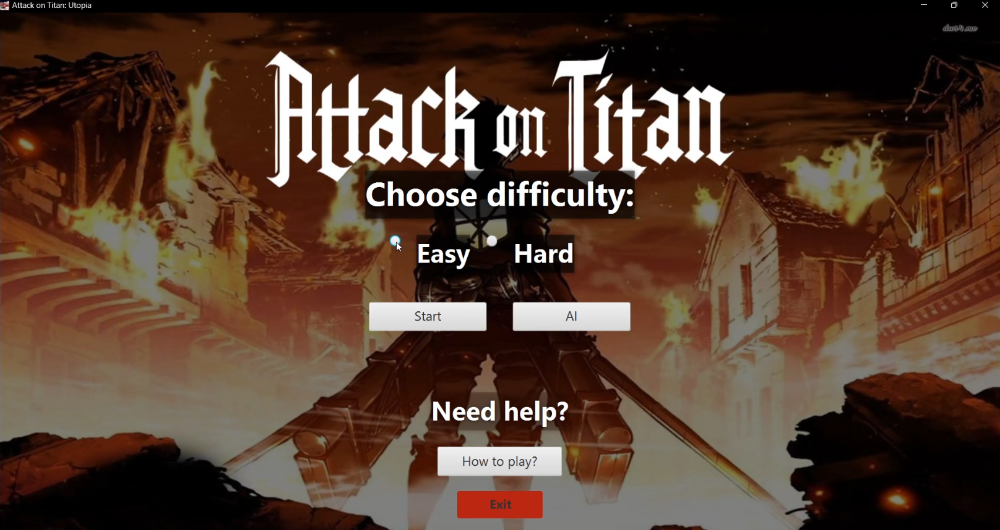
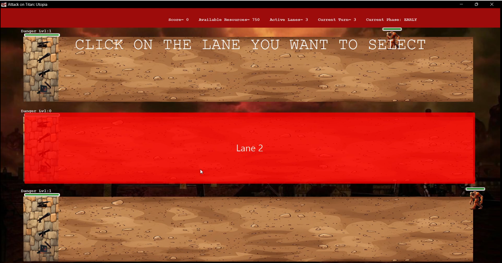
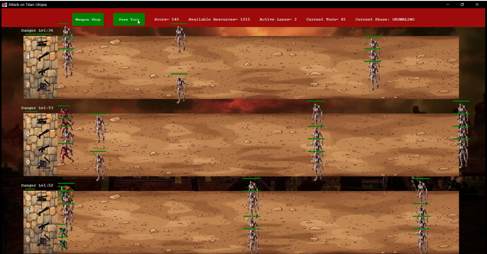
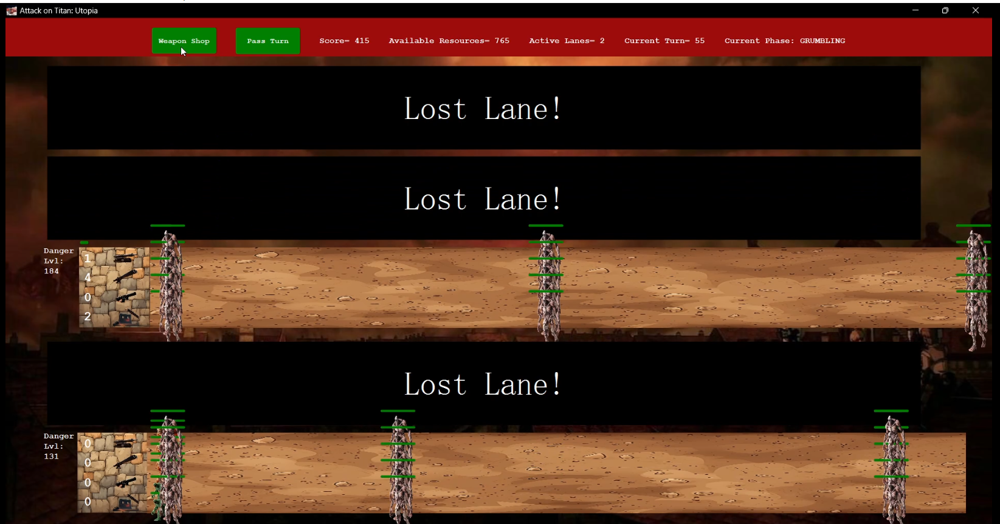
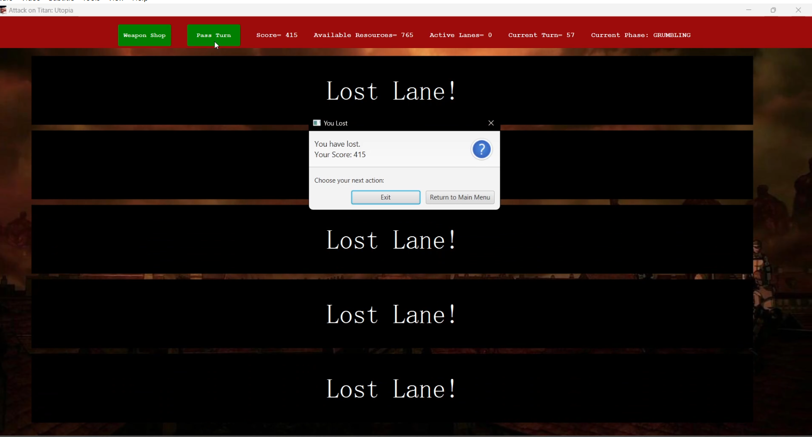

# Attack on Titan: Utopia 🎮

**A single-player, endless tower defense game** inspired by the anime *Attack on Titan*. Built with Java and JavaFX, this project simulates defending the Utopia District against various types of titans using a strategic deployment of anti-Titan weapons.

---

## 🛠️ Tech Stack
- **Language:** Java
- **Frontend:** JavaFX
- **Architecture:** MVC (Model-View-Controller)
- **IDE:** Eclipse

---

## 📦 Features
- 🧠 **Multiphase Battle Flow**: Transition through Early, Intense, and Grumbling phases with escalating titan spawns.
- 🏹 **Weapon Variety**: Multiple weapon types with unique behaviors like Piercing Cannon, Sniper Cannon, Volley Spread Cannon, and Wall Trap.
- 💥 **Enemy AI**: Multiple titan types with different HP, speed, damage, and special abilities (e.g. Armored, Colossal).
- 🎮 **Game Modes**: Choose between Easy and Hard difficulty modes.
- 📊 **Real-Time Stats**: View wall HP, titan stats, resources, score, and lane danger levels dynamically.
- 🧩 **Modular Design**: Separated into engine logic and GUI components using MVC principles.

---

## 🚀 How to Run

1. Clone the repository:
   ```bash
   git clone https://github.com/your-username/attack-on-titan-utopia.git
   cd attack-on-titan-utopia
   ```

2. Open the project in **Eclipse** (or another IDE that supports JavaFX).

3. Make sure **JavaFX SDK** is correctly added to the project:
   - Go to **Project > Properties > Java Build Path > Libraries**
   - Click **Add Library > User Library > JavaFX SDK**

4. Set the JavaFX VM arguments:
   - Go to **Run > Run Configurations > Arguments > VM arguments**
   - Add:
     ```
     --module-path /path/to/javafx-sdk/lib --add-modules javafx.controls,javafx.fxml
     ```
     Replace `/path/to/javafx-sdk` with your actual path.

5. Run `MainMenu.java` to start the game.

---

## 📂 Project Structure
```
src/
├── game/
│   ├── engine/           # Core game logic (Battle, Titans, Weapons)
│   ├── gui/              # JavaFX GUI (MainMenu, EasyMode, WeaponShop)
│   └── tests/            # Optional testing (if any)
└── weapons.csv, titans.csv  # Initial data loaders
```

---

## 📸 Screenshots

### 🎬 Watch the Demo
[](https://drive.google.com/file/d/1avpSXrzE8tp1GoD-iDM-Ct_-68flepOp/view?usp=drive_link)

### 🖼️ Main Menu


### 🕹️ Easy Mode Gameplay



### 💀 Hard Mode Gameplay




---

## 🧑‍💻 Team
Developed by Team 148 – German University in Cairo (Spring 2024)

---

